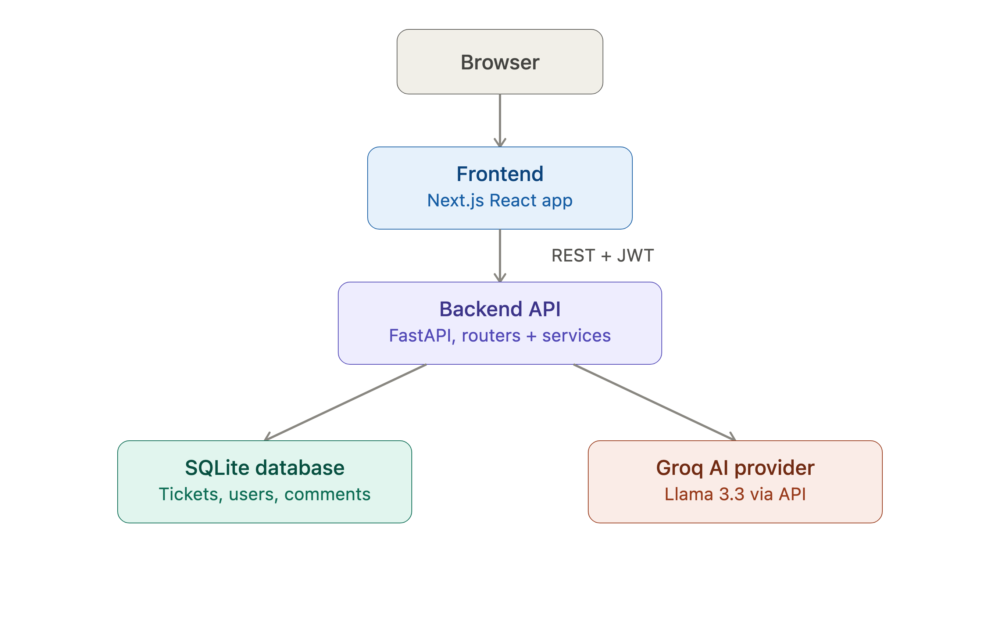
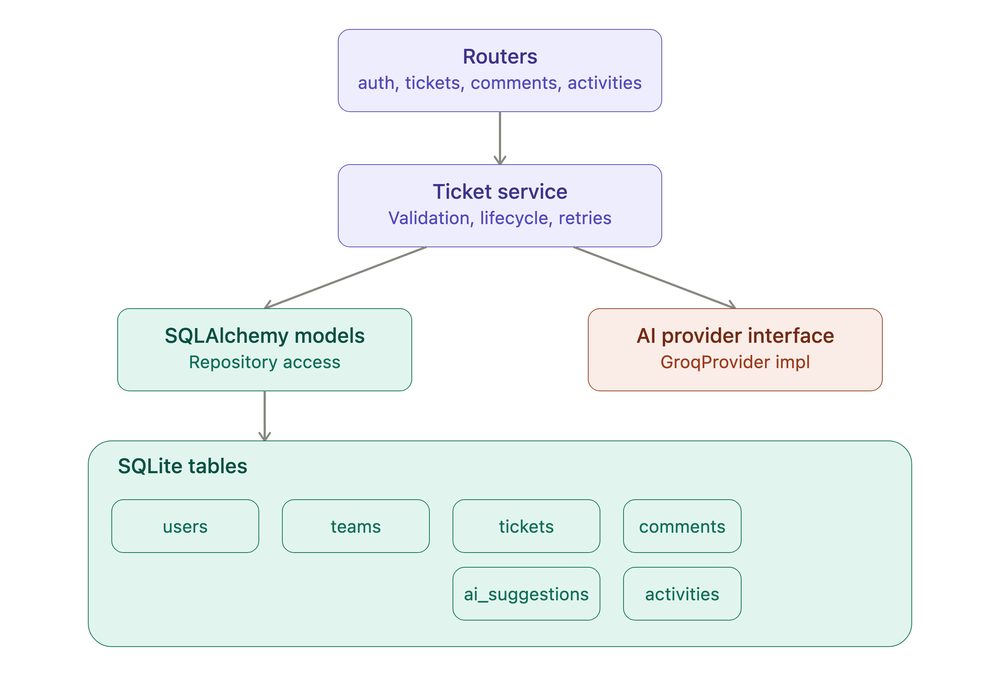

# Support Ticket Triage and Assignment System

AI-assisted support ticket triage app built for the 4Sight AI 48-hour engineering challenge.

## Tech Stack

- **Backend:** FastAPI (Python), SQLAlchemy, SQLite
- **Frontend:** Next.js (App Router), TypeScript, Tailwind CSS
- **AI Provider:** Groq (Llama 3.3 70B), via a swappable provider interface
- **Auth:** JWT-based, seeded demo user

## Architecture Diagrams

### High-Level Design



### Low-Level Design



## Setup

### Backend

<<<<<<< HEAD

=======

> > > > > > > origin/main

```bash
cd backend
python -m venv .venv
source .venv/bin/activate       # Windows: .venv\Scripts\activate
pip install -r requirements.txt
cp .env.example .env            # then add your real GROQ_API_KEY
python seed.py                  # creates demo user + teams
uvicorn main:app --reload --port 8001
```

<<<<<<< HEAD

API docs available at `http://127.0.0.1:8001/docs`.

### Frontend

=======
API docs available at `http://127.0.0.1:8001/docs`.

### Frontend

> > > > > > > origin/main

```bash
cd frontend
npm install
cp .env.example .env.local      # points at http://127.0.0.1:8001 by default
npm run dev
```

<<<<<<< HEAD

App available at `http://localhost:3000`.

### Demo login

=======
App available at `http://localhost:3000`.

### Demo login

> > > > > > > origin/main
> > > > > > > Email: demo@4sightai.com
> > > > > > > Password: demo1234

Documented dev login per assignment section 5.1 — not a production auth flow.

## Environment Variables

**Backend (`backend/.env`):**
| Variable | Description |
|---|---|
| `GROQ_API_KEY` | API key from console.groq.com (free tier) |
| `JWT_SECRET` | Any random string, used to sign auth tokens |

**Frontend (`frontend/.env.local`):**
| Variable | Description |
|---|---|
| `NEXT_PUBLIC_API_URL` | Base URL of the backend API |

## AI Model Configuration

Provider: Groq, model `llama-3.3-70b-versatile`, chosen for free-tier access and fast response times suitable for a synchronous "Save and Analyze" UI flow.

Provider logic is isolated behind an `AIProvider` abstract interface (`backend/ai/base.py`). Swapping providers means writing one new class implementing `analyze_ticket()` — no changes needed to the service layer, routers, or frontend.

## AI Output Validation & Failure Handling

- AI responses are parsed as JSON and validated against a Pydantic schema (`TicketAnalysis`) enforcing required fields, allowed category/priority values, and non-empty text.
- **Retry strategy:** on invalid/malformed JSON, the system retries the AI call once before giving up (smaller/faster hosted models occasionally return malformed output on a single call, rarely twice in a row). We deliberately do not attempt to repair broken JSON via string manipulation, since guessing where to insert missing quotes around free-text content risks silently corrupting the AI's actual wording.
- If both attempts fail, the ticket remains fully saved and usable — the user sees a clear inline error and can manually retry AI analysis from the ticket details page.
- The original customer-submitted description is never modified by AI and is stored separately from AI-generated fields.

## Ticket Status Behavior

Six statuses are supported: Open, Assigned, In Progress, Waiting for Customer, Resolved, Closed. Transitions are **not strictly enforced** (per assignment section 12, this is optional) — any status can move to any other status. Assigning a team automatically moves a ticket from Open to Assigned.

## Data Model

See `ARCHITECTURE.md` for the full table breakdown. Key decision: AI suggestions are stored in a separate, immutable `ai_suggestions` table, while `tickets` holds the current human-confirmed values. This keeps AI output permanently distinguishable from user edits, and means the original AI suggestion is never lost even after a human overrides it.

## Known Limitations / Trade-offs

- **Single user role** — all authenticated users have equal access. The schema includes a `role` column on `users` to support RBAC later, but no permission checks are enforced yet.
- **Team assignment dropdown (frontend) is hardcoded** to match `seed.py`'s team list, since no `GET /teams` endpoint was built in the time available. If you re-seed with a different team order, update the frontend list or the dropdown values will be wrong.
- **No strict status-transition rules** — any status can follow any other, as permitted by the assignment spec.
- **Broad exception handling around the Groq call** — sufficient for guaranteed graceful degradation within the time-box; a production version would distinguish rate-limit vs. timeout vs. auth errors with different user-facing messaging.
- **Comments/activities use direct DB access in their routers** rather than a dedicated service layer, since they're simple CRUD with no business logic — unlike tickets, which has AI orchestration and lifecycle rules justifying a service layer.
- **No automated test suite** included given the 48-hour window; manual end-to-end testing was performed via Swagger UI and the live frontend for the full ticket lifecycle (create → analyze → review/edit → assign → status → comment → activity log).
- **SQLite** used per assignment guidance; would move to PostgreSQL for concurrent production use.

## Improvements With More Time

- `GET /teams` and `GET /users` endpoints so the frontend doesn't hardcode seed data
- Automated tests (ticket creation validation, AI schema validation, status/assignment updates)
- Role-based access control using the existing `role` column
- Pagination on the ticket list
- Docker Compose for one-command setup
